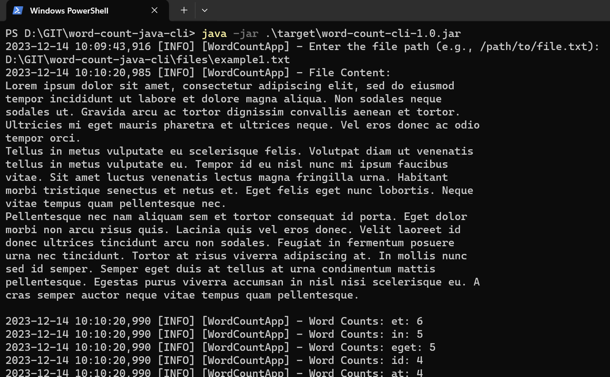
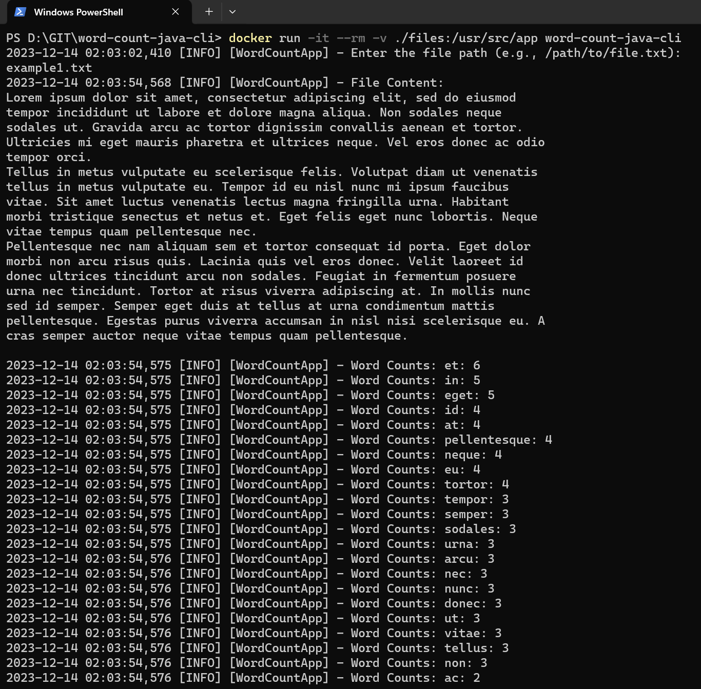

# WordCountApp

WordCountApp is a simple Java console application that computes word occurrences from a text file and sorts them by frequency.

## Table of Contents

- [Features](#features)
- [Prerequisites](#prerequisites)
- [Getting Started](#getting-started)
- [Usage](#usage)
- [License](#license)

## Features

- The program uses SLF4J for logging.
- It takes input file paths until the user enters "exit" to end the session.
- The word count is case-insensitive and ignores punctuation.
- The word counts are displayed in descending order of occurrences.
- JUnit test included

## Prerequisites

Specify any prerequisites or dependencies that users need to have installed before using your application.

### Method 1: Build and run on local machine
- Java (version 21.0.1)
- Maven (version 3.9.6)

### Method 2: Using Docker container
- Docker Desktop/CLI

## Getting Started

Method 1 will require you to install the Java SDK and Maven on your local machine.
Method 2 will only require Docker installed on your machine.

### Method 1: Build and run on local machine

```bash
# Clone the repository
git clone https://github.com/riftekhno/word-count-java-cli.git

# Navigate to the project directory
cd word-count-java-cli

# Build the project using Maven
mvn clean install
```


### Method 2: Using Docker container

```bash
# Clone the repository https://github.com/riftekhno/word-count-java-cli.git
git clone 

# Navigate to the project directory
cd word-count-java-cli

# Build the Dockerfile
docker build -t word-count-java-cli .

# Run the docker image using Docker
docker run -it --rm -v ./files:/usr/src/app word-count-java-cli
```

## Usage
Explain how to use your application. Include examples and command-line instructions.

### Method 1: Build and run on local machine

After build the file, run the command below to run the app.

```bash
java -jar .\target\word-count-cli-1.0.jar
```

Then a user input will prompt for the file path. Insert the file path and press enter. You should get the output as below.


### Method 2: Using Docker container
If you successfully run the Dockerfile, a console user input will be prompted to provide the file path.
In the Dockerfile we have copied the "file" directory from the repository into the container volume.

Insert the txt filename as shown below. To provide more txt files just add txt files inside the "file" directory and re-run the Dockerfile again.



##  License
Specify the license under which your project is distributed.

MIT License
